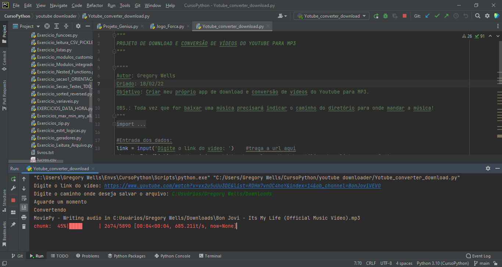
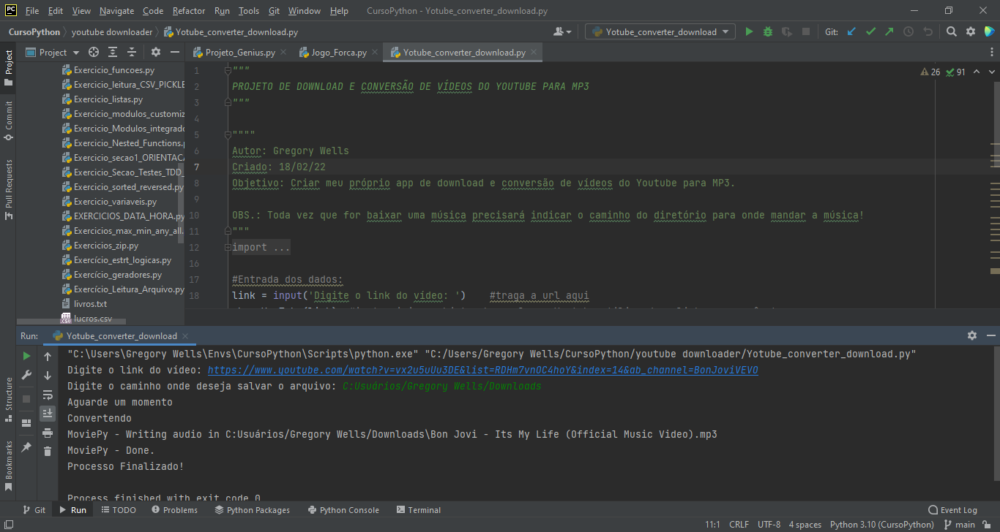

# Youtube video downloader e converter
> programa que baixa e converte vídeos do youtube no formato em MP3.

Esse programa tem o intuíto de baixar vídeos do youtube em formato MP4 e converte-los em formato MP3. Para isso é necessário que usuário informe o link do vídeo para download e depois informar o caminho do diretório onde o mesmo deverá ser salvo.
Ex.: C:/user/userName/Download 

---

## Módulos utilizados
Os módulos utilizados foram o pytube, necessário para se ter comunicação com o youtube. Movieypy para converter de MP4 para MP3. RE e OS (sitstema operacional) para dar o caminho onde salvar a música
Instalando pytube:
`pip install pytube`
Instalando moviepy:
`pip install moviepy`

## Uso
Este projeto serve para quem não tem dinheiro para investir em Spotify ou outro aplicativo e não queira usar as ferramentas online por medo de virus.

## Meta
Gregory Wells de Carvalho Barteles - gregorywells93@gmail.com.